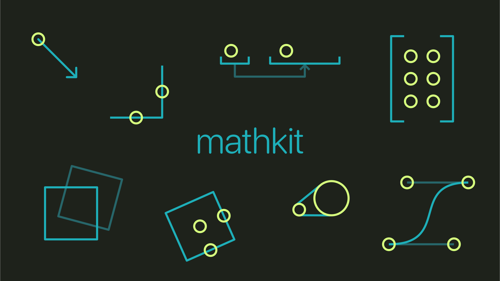

> [!IMPORTANT]
> This codebase is deprecated, and has been moved to [@figureland/kit](https://github.com/figureland/kit/).



[](https://github.com/figureland/mathkit/actions/workflows/ci.yml)
[](https://img.shields.io/npm/v/@figureland/mathkit.svg)

**mathkit** is a collection of tools for working with numbers, matrices, shapes and more. The aim here is to have something minimal and unbloated, and also a place to learn by building from scratch.

> [!NOTE]
> It would be great to use [DOMMatrix](https://developer.mozilla.org/en-US/docs/Web/API/DOMMatrix#specifications) and [DOMPoint](https://developer.mozilla.org/en-US/docs/Web/API/DOMPoint#specifications) more. I could remove a big chunk of this library. But somehow I found them inflexible and didn't perform that well. Maybe something to do with having to call `new DOMMatrix()` every time you want to multiply two matrices, for example, feels as if it incurs a real cost if you're running it every frame. Maybe in 2024 that's not the case and when I have time I will revisit. They would need to be polyfilled somehow in Bun/node.js servers.
>
> In the meantime, there are some helpers in [src/style.ts](./src/style.ts) to help with translation.

Credit to [gl-matrix](https://glmatrix.net/) for inspiration, some API choices and indeed directly copying over a few methods. A library I've used many many times over the years.

## Scripts

### Install

```bash
bun install
```

### Test

```bash
bun test
```

### Build

```bash
bun run build
```
